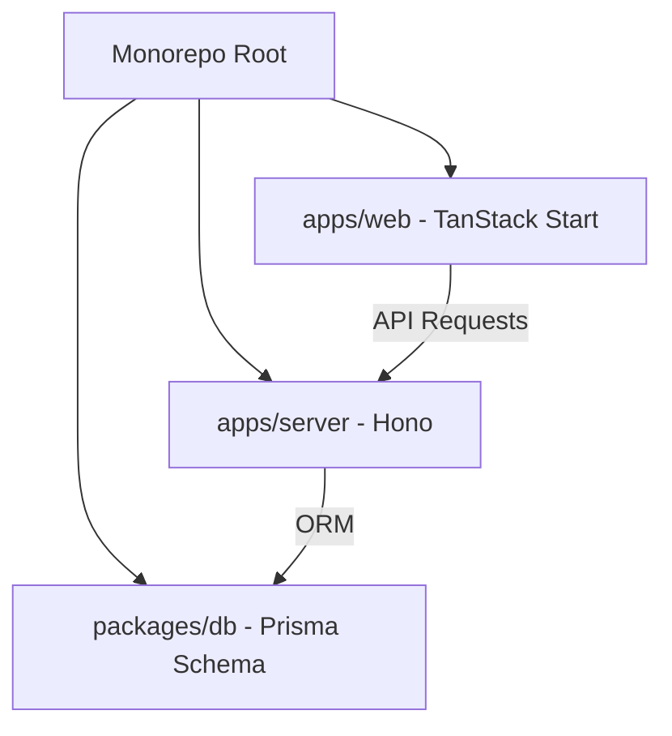

# ChairSleep Project Architecture

このプロジェクトは、Rails から TanStack Start + Hono のモダンなスタックへ移行されたアプリケーションです。
モノレポ構成を採用しており、フロントエンドとバックエンドが疎結合でありながら密接に連携しています。

## 全体構成 (Monorepo)



## TanStack Start のアーキテクチャ

`apps/web` は **TanStack Start** を使用しています。これは TanStack Router をベースとしたフルスタックなフレームワークです。

### 1. ファイルベースルーティング (File-based Routing)

`src/routes` ディレクトリ内のファイル構造がそのままアプリケーションのパスになります。

- `__root.tsx`: アプリケーション全体のシェル（HTML基本構造）と共通レイアウトを定義します。
- `index.tsx`: トップページ (`/`)
- `posts/index.tsx`: 投稿一覧 (`/posts`)
- `posts/$id.tsx`: 投稿詳細 (`/posts/:id`)
- `login.tsx` / `signup.tsx`: 認証ページ

### 2. サーバーサイドレンダリング (SSR) とハイドレーション

TanStack Start はデフォルトで SSR を行います。
1. サーバー側で React コンポーネントが HTML にレンダリングされます。
2. `__root.tsx` の `ShellComponent` がその土台となります。
3. `Scripts` コンポーネントにより、クライアント側でハイドレーションが行われ、インタラクティブな SPA として動作します。

### 3. シェルコンポーネント (`__root.tsx`)

アプリケーションの「殻」となる部分です。以下の重要な役割を担っています：
- HTMLタグ、Head要素の管理。
- `AuthProvider`: アプリケーション全体でユーザーの認証状態を共有します。
- `Layout`: ヘッダーやフッターなど、全ページ共通のデザインを適用します。

### 4. 認証フロー

`src/context/AuthContext.tsx` を中心に管理されています。

- `useAuth` フックを通じて、どのコンポーネントからでも現在のログインユーザー情報にアクセスできます。
- バックエンドの Hono API (`/api/auth/me`) と通信し、Cookie ベースの JWT 認証を行います。

## バックエンド (Hono)

`apps/server` は TypeScript に最適化された高速な Web フレームワーク **Hono** を採用しています。

- **Prisma**: ORM として使用し、PostgreSQL との通信を型安全に行います。
- **JWT Authentication**: セッション管理に JWT を使用し、HttpOnly Cookie でセキュアに保持します。
- **LINE Login**: LINE OAuth 2.0 連携をネイティブにサポートしています。

## 開発の進め方

### セットアップ

```bash
npm install
```

### データベース起動 (Docker)

```bash
docker-compose up -d
```

### 開発サーバー起動

```bash
# 全体起動 (Turbo使用)
npm run dev

# 個別起動
cd apps/web && npm run dev
cd apps/server && npm run dev
```

## 技術スタック詳細

- **Frontend**: TanStack Start, React, Tailwind CSS, Lucide React
- **Backend**: Hono, Node.js
- **Database**: PostgreSQL, Prisma (ORM)
- **Auth**: JWT, LINE OAuth 2.0
- **Tools**: Vite, TypeScript, Agent Skills

## Agent Skills (エージェントスキル)

このプロジェクトでは、AI エージェントが開発を補助し、コード品質を維持するための「エージェントスキル」を導入しています。

### 導入済みのスキル
- **vercel-react-best-practices**: Vercel エンジニアリングによる React および Next.js のパフォーマンス最適化ガイドラインです。
- **doc-management**: プロジェクトのドキュメント品質を維持するためのガイドライン。README や walkthrough 等の更新基準を定義しています。
- **find-skills-jp**: 日本語でのスキル検索・追加を支援する、Skills CLI のラッパー的なガイダンスを提供します。

スキルは `.agents/skills` ディレクトリに格納されており、個別のルールや詳細は各スキルの `SKILL.md` または `AGENTS.md` で確認できます。
