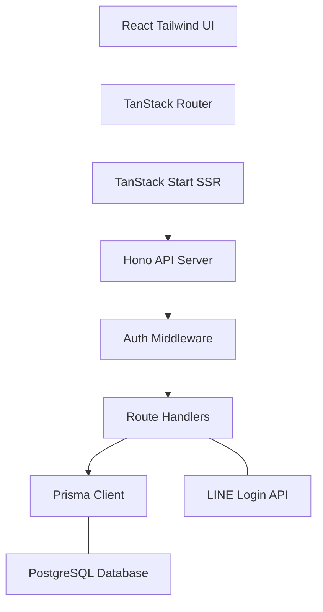

# ChairSleep アプリケーションアーキテクチャ概要

本ドキュメントは、ChairSleepプロジェクトの全体的なアーキテクチャと使用されている技術スタックをまとめたものです。

---

## 1. システム構成（モノレポアーキテクチャ）

本プロジェクトは **npm workspaces** を利用したモノレポ構成を採用しており、フロントエンドアプリケーションとバックエンドAPIサーバーが一つのリポジトリ内に独立したパッケージとして管理されています。
これにより、依存関係の管理の平易化やプロジェクト全体のコードの一元管理を行っています。

```text
chair_sleep/new_app/
├── apps/
│   ├── web/        # フロントエンド (TanStack, React)
│   └── server/     # バックエンドAPI (Hono, Node.js)
├── packages/       # (将来的な共通ライブラリや型定義の共有用)
├── docs/           # ドキュメント群
└── package.json    # ワークスペース定義 ("apps/*")
```

---

## 2. フロントエンド (`apps/web`)

**ChairSleepのユーザーインターフェースとしての役割を果たします。**

### コア技術スタック
- **UIライブラリ**: [React](https://react.dev/) (v19)
- **ビルドツール**: [Vite](https://vitejs.dev/) - 高速なHMR（Hot Module Replacement）と本番ビルドを提供
- **ルーティング**: [TanStack Router (Start)](https://tanstack.com/router/latest) - 完全に型安全なファイルベースルーティングとデータフェッチ
- **スタイリング**: [Tailwind CSS](https://tailwindcss.com/) (v4) - ユーティリティファーストのCSSフレームワーク
- **E2Eテスト**: [Playwright](https://playwright.dev/) - 実ブラウザベースの統合テストフレームワーク
- **ユニットテスト**: [Vitest](https://vitest.dev/)

### アーキテクチャの特長
- **型安全なルーティングとデータ**: `routeTree.gen.ts` によって自動生成されるルート型定義を利用し、APIから取得したデータを含めてURLパスからプロパティまでアプリケーション全体の型安全性を強固に担保しています。
- **データフェッチ**: TanStack Routerの `loader` を使用して、コンポーネントレンダリング前に必要なデータをバックエンドから取得し、クライアントにおけるウォーターフォール現象を防いでいます。

---

## 3. バックエンド (`apps/server`)

**データベース操作と、フロントエンドに対するセキュアなRESTful APIを提供する役割を果たします。**

### コア技術スタック
- **APIフレームワーク**: [Hono](https://hono.dev/) - Fetch API（Web Standard）ベースの超高速かつ軽量なルーター
- **ORM / データベース**: [Prisma](https://www.prisma.io/) + **PostgreSQL**
- **認証機構**: JWT (JSON Web Token) ベースのセッション管理と、**LINE Login**（OAuth）の統合
- **データ構造化**: TypeScriptを利用した堅牢な型定義

### アーキテクチャの特長
- **モジュラーなルーティング**: `Hono` インスタンスを機能ごと（`auth.ts`, `posts.ts`, `items.ts` など）に分割生成し、`index.ts` にてマウントするモジュラー構造を採用。
- **ミドルウェアによる一元管理**: JWTを用いた認証チェック（`authMiddleware`）等を通して、安全なエンドポイントを簡潔に定義。
- **データシリアライゼーション**: データベースから返却される特殊な型（Prismaの `BigInt` など）を適切にJSONに変換してフロントへ送るためのヘルパー関数（`serializeBigInt`）を活用。

---

## 4. 認証フローの仕組み

ChairSleepは独自の「メール＆パスワードログイン」と「LINEログイン（ソーシャルログイン）」の両方をサポートしています。

1. **認証リクエスト**: ユーザーが認証情報を送信、またはLINEからコールバックされる。
2. **トークン生成**: `apps/server` がユーザーを特定 / 作成し、情報を含んだJWTを生成。
3. **Cookieセット**: JWTをサーバー側で `httpOnly: true` のCookieに書き込み。
4. **APIアクセス保護**: 以降のAPIコールではブラウザが自動付与するCookieをミドルウェア（`authMiddleware`）が検証。

---

## 5. データの流れ (アーキテクチャ図解)

（※お使いのMarkdownプレビュー環境がMermaid図表に対応していない場合、以下のテキスト図解をご参照ください）

```text
[Client Browser]
  (React / Tailwind UI) <--> (TanStack Router)
                                   |
                                 fetch
                                   |
[Front-end: Vite Port 3000]        |
  (TanStack Start SSR) <-----------+
                                   |
                                 fetch
                                   v
[Back-end: Hono Port 4000]
  (Hono API Server) --> (Auth Middleware) --> (Route Handlers)
                                                    |
                                                    +--> [External] (LINE Login API)
                                                    |
                                                    v
                                             (Prisma Client)
                                                    |
[Database]                                          v
  (PostgreSQL) <------------------------------------+
```

### Mermaid対応環境用プレビュー


---

## まとめ

ChairSleepは、モダンなTypeScriptベースのモノレポ構成として設計されています。
**TanStack Router** による強固な型安全とデータ制御と、**Hono + Prisma** の軽量かつ高速なバックエンドを組み合わせることで、開発者体験に優れメンテナンスのしやすい強力なアーキテクチャを実現しています。
