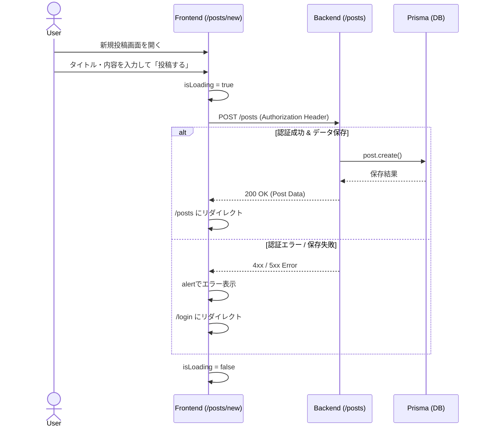

# CRUD（投稿管理）機能 仕様書

## 1. 概要
本ドキュメントは、ログイン後のメイン機能である投稿（Posts）に関するCRUD（作成・読み取り・更新・削除）操作の仕様と実装詳細についてまとめたものです。
フロントエンドはTanStack Router、バックエンドはHonoを利用して実装されています。

## 2. アーキテクチャ構成
フロントエンドとバックエンドで以下のエンドポイント・ルーティングが設定されています。

| 機能 | フロントエンドルート | バックエンドエンドポイント | 認証必須 | 備考 |
|---|---|---|---|---|
| **一覧表示 (Read)** | `/posts/` | `GET /posts` | 任意 | 全ユーザーの投稿一覧（新着順） |
| **詳細表示 (Read)** | `/posts/$id` | `GET /posts/:id` | 任意 | 特定の投稿内容と登録アイテム一覧 |
| **新規作成 (Create)** | `/posts/new` | `POST /posts` | 必須 | ユーザーによる新規投稿 |
| **更新 (Update)** | - | - | - | （未実装） |
| **削除 (Delete)** | - | `DELETE /posts/:id` | 必須 | （フロント側UI未実装）投稿作成者のみ削除可能 |

---

## 3. 機能詳細仕様

### 3.1. 投稿一覧 (一覧表示)
複数のユーザーが投稿した睡眠環境のセットアップ等の一覧を表示します。

- **フロントエンド (`apps/web/src/routes/posts/index.tsx`)**:
  - `loader` を使用し、ページレンダリング前に `apiFetch('/posts')` を呼び出してデータをフェッチ。
  - **UI要素**: 各投稿のタイトル、内容のプレビュー、投稿者情報、いいね数（`likesCount`）をカードレイアウトで表示。
  - **空状態**: 投稿が1件もない場合は、空状態（Empty State）のUIと新規作成へのリンクを表示。
- **バックエンド (`apps/server/src/routes/posts.ts`)**:
  - `prisma.post.findMany` を使用し、新着順 (`orderBy: { createdAt: 'desc' }`) でDBから取得。
  - リレーションとして `user` および `items` を同時に取得。

### 3.2. 新規投稿作成 (Create)
ユーザーが自身の睡眠環境に関する投稿を作成します。

- **フロントエンド (`apps/web/src/routes/posts/new.tsx`)**:
  - **入力項目**: タイトル（`title`）、内容（`content`）
  - **状態管理**: `title`, `content`, `isLoading` をローカルの状態で管理。
  - フォーム送信時に `POST /posts` へリクエストし、成功時は一覧 `/posts` へリダイレクト。
  - エラー時（未ログイン等）は `alert` を表示し、 `/login` へリダイレクトします。
- **バックエンド (`apps/server/src/routes/posts.ts`)**:
  - `authMiddleware` を通過する必要があり、ログイン状態（トークン）が必須。
  - リクエストから `title`, `content` を受け取り、抽出したユーザーIDを用いて `prisma.post.create` を実行。

### 3.3. 投稿詳細 (詳細表示)
特定の投稿の全体内容や、紐づくアイテム一覧を表示します。

- **フロントエンド (`apps/web/src/routes/posts/$id.tsx`)**:
  - 動的ルーティング `$id` を利用。`loader` で `apiFetch('/posts/$id')` からデータを取得。
  - **UI要素**: 投稿タイトル、投稿者名、作成日、ヒーロー画像（現在はプレースホルダー）、投稿のフルテキストを表示。
  - **アイテム一覧**: 投稿に関連付けられている構成アイテム（例：モニター、椅子、など）をリスト・グリッド表示（名前、価格など）。
- **バックエンド (`apps/server/src/routes/posts.ts`)**:
  - URLパラメータ `:id` を利用し、`prisma.post.findUnique` を実行。
  - リレーションとして `user`, `items`, `comments` (さらに `user` 情報も含む) をすべて取得。

### 3.4. 投稿削除 (Delete)
（バックエンドのみ実装済み）

- **バックエンド (`apps/server/src/routes/posts.ts`)**:
  - `authMiddleware` によってログイン必須。
  - 削除前に「投稿が存在するか」「削除しようとしているユーザーが作成者本人か」を確認し、本人以外の場合は 403 Forbidden を返却します。
  - チェック完了後、 `prisma.post.delete` でレコードを削除。

---

## 4. データ構造 (Post Model)

バックエンドで扱っているデータ構造の簡略図です（シリアライズ考慮）。

```typescript
type Post = {
  id: number;
  title: string;
  content: string;
  userId: number;       // 投稿者のID
  likesCount: number;   // いいねの数（デフォルト 0）
  createdAt: Date;
  updatedAt: Date;
  // リレーション
  user?: User;
  items?: Item[];
  comments?: Comment[];
}
```
※ Prismaから取得したデータに含まれる `BigInt` 型のカラムは、JSONシリアライズ時に文字列 (`string`) に変換されてフロントエンドに送信されています。

## 5. 状態遷移フロー (新規投稿)


