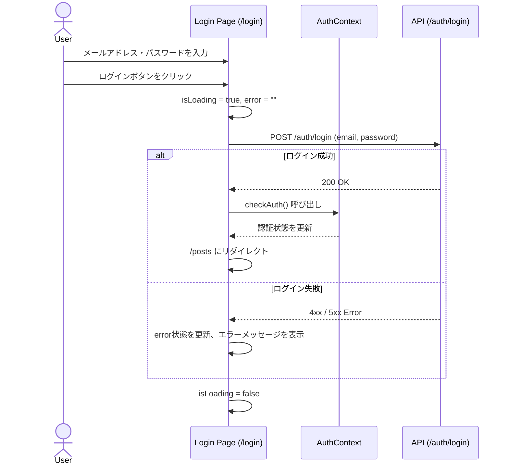

# ログインページ 仕様書

## 1. 概要
本ドキュメントは、本プロジェクトのログインページ（`/login`）の仕様と実装詳細についてまとめたものです。
TanStack Router を用いたファイルベースルーティング（`apps/web/src/routes/login.tsx`）で実装されています。

## 2. デザイン・UI構成
- **レイアウト**: 画面中央に配置されたカード型のクリーンなデザイン。
- **スタイリング**: Tailwind CSS を採用し、ボタンにはグラデーション（`bg-gradient-to-r from-blue-600 to-indigo-600`）やホバー時のアニメーション（`hover:scale-[1.02]`）が適用されています。
- **レスポンシブ**: モバイル端末からデスクトップまで対応する幅設定（`max-w-md`、`w-full`）。

## 3. 機能仕様

### 3.1. メールアドレス・パスワードログイン
自社バックエンド（`/auth/login`）を利用した通常の認証機能です。

- **入力フォーム**:
  - **メールアドレス**: `type="email"`、必須項目
  - **パスワード**: `type="password"`、必須項目
- **送信処理 (`handleSubmit`)**:
  - フォーム送信時にローディング状態（`isLoading`）を `true` にし、二重送信を防止します。
  - `apiFetch` ユーティリティを用いて `POST /auth/login` エンドポイントへリクエストを送信します。
  - ログイン成功時:
    1. `useAuth` フックの `checkAuth()` を呼び出し、グローバルな認証状態を更新します。
    2. ルーター（`useRouter`）を用いて `/posts` ページに遷移（リダイレクト）します。

### 3.2. LINEログイン（ソーシャルログイン）
「LINEでログイン」ボタンをクリックすることで、LINEアカウントを用いた認証フローを開始します。

- **リンク先**: `http://localhost:4000/api/auth/line`
- **デザイン**: LINE公式のブランドカラー（`#06C755`）と標準のSVGアイコンを使用しています。

### 3.3. 新規登録ページへの遷移
アカウントをまだお持ちでないユーザー向けに、画面下部に新規登録ページ（`/signup`）へのリンクを配置しています。

## 4. エラーハンドリング
- **エラー表示**: ログイン処理が失敗した場合（APIからのエラーレスポンス等）、エラーメッセージ（`err.message` または "ログインに失敗しました"）を取得し、状態 `error` にセットします。
- **UIフィードバック**: エラー状態が存在する場合、フォームの上部に赤色の警告ボックス（`border-l-4 border-red-500`）でエラー内容をユーザーに明示します。エラーメッセージは次回の送信開始時にリセットされます。

## 5. 状態管理（State）
コンポーネント内では以下のローカルステート（`useState`）およびコンテキストを利用して状態を管理しています。

| 状態名 | 型 | 初期値 | 役割 |
|---|---|---|---|
| `email` | `string` | `""` | ユーザーが入力したメールアドレスの保持 |
| `password` | `string` | `""` | ユーザーが入力したパスワードの保持 |
| `error` | `string` | `""` | ログイン失敗時のエラーメッセージの保持 |
| `isLoading` | `boolean` | `false` | 通信中の状態管理（ローディング表示やボタンの無効化に使用） |
| `checkAuth` | `function` | - | `AuthContext` から取得。成功時に認証状態を再取得する関数 |

## 6. フロー図

